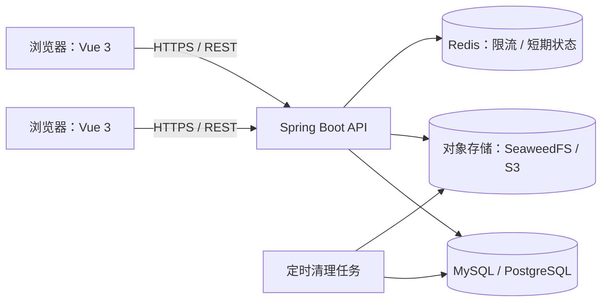
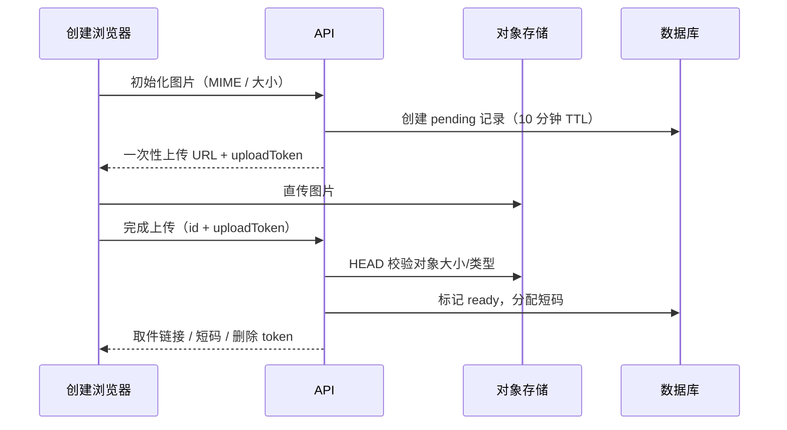

# PasteHub 技术方案（MVP）

> 版本：0.1 · 日期：2026-08-16 · 对应产品方案：v0.2

## 1. 目标与边界

本方案支持匿名用户在浏览器中创建**文本或图片**投递，另一台设备通过链接、二维码或 6 位取件码读取，并在创建后 10 分钟自动删除。

第一版不做登录、历史记录、实时空间、文件传输、端到端加密或原生剪贴板后台同步。

### 非目标

- 不承诺内容对服务端不可见；只承诺 HTTPS 传输、最少日志与按期删除。
- 不支持敏感信息传输。前端和文档持续提示用户不要上传密码、验证码、私钥。
- 不尝试阻止接收者截图或复制内容。

## 2. 推荐架构

采用「Vue 单页前端 + Spring Boot REST API + 临时元数据数据库 + 对象存储」的前后端分离架构；这让第一版足够简单，也为后续实时空间保留扩展点。



### 推荐技术选型

| 层 | 首选 | 理由 |
| --- | --- | --- |
| Web | Vue 3 + TypeScript + Vite + Vue Router | 页面少、开发快；适合极简的中文普通用户产品 |
| API | Spring Boot 3 + Java 21 | 成熟、易维护；定时清理、参数校验、限流和储存适配完整 |
| 元数据 | MySQL 8（或 PostgreSQL） | 唯一索引保证短码不冲突、便于 TTL 清理；首选 MySQL 8 |
| 图片 | SeaweedFS（自建）或 S3 兼容托管存储（生产） | Apache 2.0；适合大量小图片，支持 S3 API 与 TTL |
| 缓存与限流 | Redis | 匿名请求频控、验证码挑战状态、热点读取保护 |
| 二维码 | 前端生成 | 不上传二维码、减少服务端工作 |
| 观测 | 结构化错误事件 + 指标 | 不记录内容、完整链接或删除令牌 |

前端编译为静态资源，由 Nginx 托管；Nginx 反向代理 `/api` 到 Spring Boot。开发环境使用 Docker Compose 一次启动前端、后端、MySQL、Redis 与 SeaweedFS；生产环境可先以单台云服务器部署，后续再拆分扩容。

### S3 兼容对象存储选型

| 方案 | 许可证 / 成熟度 | 适合程度 | 结论 |
| --- | --- | --- | --- |
| **SeaweedFS** | Apache 2.0；成熟 | 大量小对象、单机起步后可扩展；提供 S3 API 与文件 TTL | **首选** |
| Garage | AGPL-3.0；轻量 | 小型、跨地域自建集群 | 暂不选：面向 SaaS 要先评估 AGPL 义务 |
| Ceph RGW | LGPL；非常成熟但重 | 多节点、PB 级、已有 Ceph 团队 | 暂不选：对 MVP 运维成本过高 |
| RustFS | Apache 2.0；较新 | 值得关注的 MinIO 替代 | 暂不选：生产成熟度仍需观察 |
| MinIO | 生态成熟，但许可证/开源发行策略变化较大 | 既有用户迁移与商业支持场景 | 新项目不作为默认选择，部署前需再次核对支持与许可证 |

开发环境将 Docker Compose 中的对象存储替换为 SeaweedFS；后端只依赖 AWS SDK for Java 的 S3 API，因此将来切换到 AWS S3、Cloudflare R2 或其他 S3 服务无需改变业务层。

### 前后端职责边界

| 前端（Vue） | 后端（Spring Boot） |
| --- | --- |
| 粘贴文本/图片、上传前校验、展示倒计时、生成 QR、复制链接 | 生成 ID/短码、持久化元数据、签发上传 URL、取件、删除与过期清理 |
| 不持有服务端密钥；只在 `sessionStorage` 保存创建者删除 token | 校验类型、大小、过期状态和删除 token；不记录正文或 token |
| 路由 `/`、`/created/:id`、`/t/:id`、`/expired` | REST API 统一挂载 `/api/v1` |

## 3. 核心领域模型

### Transfer（一次投递）

| 字段 | 类型 | 说明 |
| --- | --- | --- |
| `id` | UUID / 128-bit 随机 ID | 分享链接的稳定标识，不使用可枚举 ID |
| `code` | 6 位随机码 | 输入取件用；大写、排除易混淆字符 |
| `kind` | `text` / `image` | 内容类型 |
| `text_content` | nullable text | 仅文本投递使用；最多 10,000 字符 |
| `object_key` | nullable string | 图片对象存储键，不公开真实路径 |
| `mime_type` | nullable string | 只接受 JPEG、PNG、WebP |
| `size_bytes` | integer | 图片限制 10 MB |
| `expires_at` | timestamp | 创建时间 + 10 分钟，不可延长 |
| `delete_token_hash` | string | 创建者删除能力的哈希，不能反推原 token |
| `created_at` | timestamp | 仅用于清理与指标 |
| `deleted_at` | nullable timestamp | 可选审计标记；内容本身立即删除 |

数据库约束：`id`、`code` 唯一；`expires_at` 建索引；文本和图片字段互斥。

## 4. API 设计

API 使用 JSON，版本前缀为 `/api/v1`。所有响应带 `Cache-Control: no-store`；读取内容页也不得被 CDN 或浏览器缓存。

| 方法 / 路径 | 用途 | 请求重点 | 返回重点 |
| --- | --- | --- | --- |
| `POST /api/v1/transfers/text` | 创建文本 | `content` | `id`、`code`、`pickupUrl`、`deleteToken`、`expiresAt` |
| `POST /api/v1/transfers/image/init` | 初始化图片上传 | `mimeType`、`sizeBytes` | `id`、预签名上传 URL、`uploadToken` |
| `POST /api/v1/transfers/image/complete` | 校验并发布图片 | `id`、`uploadToken` | `code`、`pickupUrl`、`deleteToken`、`expiresAt` |
| `GET /api/v1/transfers/{id}` | 链接取件 | 无 | 文本或短时图片下载 URL；失效则 404 |
| `GET /api/v1/transfers/code/{code}` | 短码取件 | 无 | 302 到取件页面或返回 `id` |
| `DELETE /api/v1/transfers/{id}` | 创建者手动删除 | `Authorization: Bearer deleteToken` | `204`；重复删除也返回 `204` |

### 短码与链接

- 短码字符集采用 32 个无歧义字符（排除 `0/O`、`1/I/L`）；6 位约有 10.7 亿种组合。
- 每次创建短码前通过数据库唯一约束兜底重试；不得依赖“概率上不会冲突”。
- `pickupUrl` 使用 `https://pastehub.example/t/{id}`；二维码指向该 URL。
- 取件码可视为便利索引，**不是安全凭证**。链接同样不用于传递机密内容。

## 5. 前端设计与交互实现

### 路由

| 路由 | 职责 |
| --- | --- |
| `/` | 极简首页：发送 / 取件 |
| `/created/{id}` | 创建结果、二维码、倒计时、复制链接、删除 |
| `/t/{id}` | 取件内容；读取 API 后展示 |
| `/expired` | 失效/删除统一页面 |

### 首页关键实现

- 文本框接受粘贴文本；监听 `paste` 事件，若剪贴板含一张允许类型的图片，切换为图片预览。
- 图片上传前在浏览器验证 MIME、体积和像素风险；服务端再次验证内容类型和文件大小，不能只相信客户端。
- 点击发送时禁用重复提交，显示明确的「正在创建」状态。
- 结果页 QR 在浏览器使用 `pickupUrl` 生成；倒计时以服务端 `expiresAt` 为准。
- 复制按钮使用 Clipboard API；失败时显示可手动选择的链接文本。
- 移动端优先：取件码使用 `inputmode="text"`、自动大写、自动分组展示。

### 本地权限

- `deleteToken` 只存在创建者当前标签页内存与 `sessionStorage`，不写入 URL。
- 关闭会话后仍可凭分享链接取件，但不提供删除权；这是匿名产品可接受的取舍，界面需写明「本页关闭后不能再手动删除」。

## 6. 图片上传与读取流程



未完成的上传必须在 5 分钟内清理。读取图片时 API 生成有效期 60 秒的下载 URL，或通过 API 流式代理；两种方案都要防止对象路径被公开、被长期缓存。

## 7. 安全、隐私与滥用控制

### 必须实施

- TLS、HSTS、CSP、`X-Content-Type-Options: nosniff`、`Referrer-Policy: no-referrer`。
- 内容页和 API 响应统一 `Cache-Control: no-store, private`。
- 文本按纯文本渲染，绝不使用 `innerHTML`；图片按 allowlist MIME 处理。
- 错误追踪只记录匿名请求 ID、状态码、耗时和聚合的大小区间；禁止记录正文、图片、取件码、完整 URL、删除 token。
- 以 IP 哈希为粒度做速率限制，例如每 10 分钟最多 20 次创建、100 次读取；超过阈值才显示验证码。
- 上传前后限制类型、大小与频率；设置对象存储生命周期规则作为业务删除任务的第二道保障。

### 需要公开说明

- 服务端为完成传输会短暂保存内容，首发版不是端到端加密。
- 链接和取件码被他人获得，即可能被读取；请勿传输敏感信息。
- 到期删除会尽力立即执行，但不可将其表述为阻止接收方留存副本。

## 8. 删除策略

1. 每次读取先判断 `expires_at`；过期立即返回 404，不返回内容。
2. 定时任务每分钟扫描过期记录：删除图片对象、删除/标记数据库记录。
3. 对象存储设置 `expires_at + 24h` 的生命周期兜底，防止任务异常导致长期遗留。
4. 用户手动删除执行同一删除事务；DELETE 操作幂等。
5. 每日任务核对「数据库过期记录数、对象存储过期对象数、删除失败数」，异常告警。

## 9. 后续扩展：临时空间

第二阶段增加 `Room` 与 `RoomItem`，并引入每个空间一个 WebSocket / Durable Object（或等价的房间协调服务）。Transfer 的条目模型可直接复用，Room 只负责成员连接、实时事件和「最后离开后 10 分钟」的清理状态。

不要在首发就引入 WebSocket：单次投递的价值可以由普通 HTTP 完整验证，实时连接会增加移动网络重连、在线状态与成本复杂度。

## 10. 工程里程碑

| 阶段 | 交付 | 验收 |
| --- | --- | --- |
| P0：基础 | Vue 首页、Spring Boot 文本创建/读取、6 位码、链接、TTL | 两台浏览器可完成文本传递 |
| P1：图片 | 直传、预览、类型/大小校验、对象删除 | 手机与桌面可可靠传 10 MB 图片 |
| P2：可靠性 | 限流、清理任务、监控、错误页、移动端 QA | 删除、过期、冲突、弱网均有明确处理 |
| P3：空间 | WebSocket 房间、条目流、最后离开清理 | 多设备实时同步不影响快速投递 |

## 11. 上线前检查表

- [ ] 所有创建、读取、删除接口均有集成测试。
- [ ] 短码碰撞、过期、重复删除、未完成图片上传均有测试。
- [ ] HTML 注入、SVG/伪造 MIME、超大图、热点链接枚举均有安全测试。
- [ ] 日志与分析平台抽查无内容、token、完整 URL。
- [ ] 自动删除与对象生命周期在测试环境演练通过。
- [ ] 隐私说明、服务条款、敏感内容提示上线。

## 12. 推荐项目结构

```text
pastehub/
├── frontend/                         # Vue 3 + Vite + TypeScript
│   ├── src/
│   │   ├── views/                     # Home / Created / Pickup / Expired
│   │   ├── components/                # Composer / PickupCode / Countdown / QRCode
│   │   ├── services/api.ts            # 唯一 API 访问层
│   │   └── router/
│   └── vite.config.ts
├── backend/                           # Spring Boot 3 + Java 21
│   └── src/main/java/.../
│       ├── transfer/                  # controller / service / repository / dto
│       ├── storage/                   # SeaweedFS/S3 抽象
│       ├── cleanup/                   # 定时清理任务
│       └── security/                  # 限流、响应头、异常处理
├── infra/
│   ├── docker-compose.yml             # MySQL、Redis、SeaweedFS
│   └── nginx.conf
└── docs/
```
